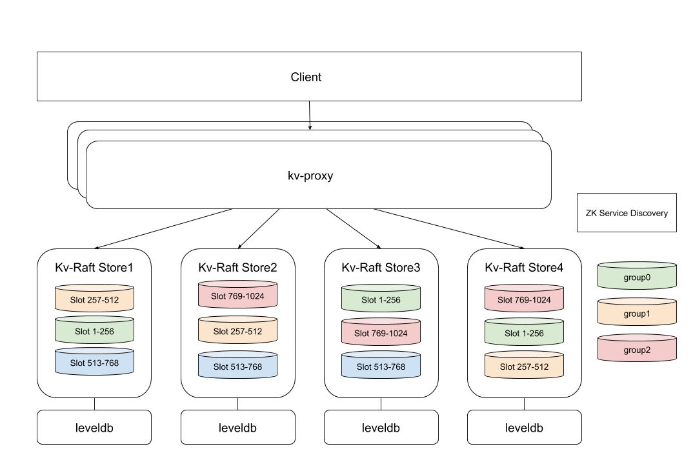

# turingkv介绍

turingkv 是一个基于Raft一致性算法的分布式kv存储系统，使用 leveldb 作为存储引擎

**系统架构**



- Proxy

  负责分发客户端的请求到具体的raft-group，并记录key的路由信息，接入zk实现服务发现。

- Node

  一个物理节点，可以同时运动运行多个属于不同group的raft进程

- Group

  一个raft进程组，默认为3副本

- Store Engine

  节点上的存储引擎，实现了LevelDB，下一步实现RocksDB，实现存储引擎的插拔。

**运行单机测试**

- 编译，进入raft-kv根目录

```
sh build.sh
```

- 运行

```
sh run.sh
```

- 设置key值

```
curl 'http://leader地址:leader api端口/keys/some-key/' -H 'Content-Type: application/json' -d '{"value": "some-value"}'
```

- 获取key值

```
curl 'http://leader地址:leader api端口/keys/some-key/'
```

- 运行基准测试

  - 安装 (Apache HTTP server benchmarking tool) http://httpd.apache.org/docs/2.0/programs/ab.html
  - 生成测试数据

  ```
  sh benchmark/gen_testdata.sh
  ```

  - 运行测试

  ```
  sh benchmark/run_test.sh
  ```

**使用docker运行测试**

- 获取镜像

```
docker pull cxspace/turingkv:v1
```

- 启动容器

```
docker run -it -d b546998a9c04(使用docker images查看镜像ID) /bin/bash
```

- 进入容器

```
docker exec -it b546998a9c04(使用docker ps查看容器ID) /bin/bash
```

- 进入项目根目录

```
cd /root/go/src/github.com/turingkv/raft-kv
```

- 启动系统

```
sh run.sh
```

- 运行测试

```
sh test_case.sh
```

- 停止系统

```
sh stop.sh
```
